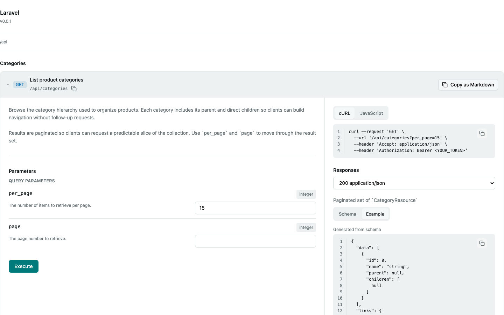

# Spectacular

OpenAPI and AsyncAPI tooling for Laravel applications.

Spectacular gives you two things from the code you already write:

- **OpenAPI** — [Scramble](https://scramble.dedoc.co) extensions that document
  [spatie/laravel-query-builder](https://github.com/spatie/laravel-query-builder) filters, sorts, includes and sparse
  fieldsets, plus pagination parameters, directly from your controller actions — no annotations required.
- **AsyncAPI** — a generator that turns your Laravel broadcast events into an [AsyncAPI 3.0](https://www.asyncapi.com)
  document, inferring channels and message payloads from the event class itself.

## Requirements

- PHP 8.4+
- Laravel 13+
- [`dedoc/scramble`](https://github.com/dedoc/scramble) `^0.13.30` (for the OpenAPI extensions)
- [`spatie/laravel-query-builder`](https://github.com/spatie/laravel-query-builder) `^7.0` (for the query-builder extension)

## Installation

```bash
composer require bambamboole/spectacular
```

The service provider is auto-discovered. Publish the config file if you want to customise the defaults:

```bash
php artisan vendor:publish --tag=spectacular-config
```

This writes `config/spectacular.php`.

## OpenAPI

Spectacular ships two Scramble [operation extensions](https://scramble.dedoc.co/usage/extending). They are registered
for you through `config/spectacular.php`:

```php
'scramble' => [
    'extensions' => [
        Bambamboole\Spectacular\OpenApi\Extensions\QueryBuilderExtension::class,
        Bambamboole\Spectacular\OpenApi\Extensions\PaginationExtension::class,
    ],
],
```

### Query builder parameters

Any action that builds a `Spatie\QueryBuilder\QueryBuilder` chain is inspected statically, and the allowed operations
become documented query parameters:

```php
use Spatie\QueryBuilder\AllowedFilter;
use Spatie\QueryBuilder\QueryBuilder;

class UsersController
{
    public function __invoke(Request $request): AnonymousResourceCollection
    {
        $users = QueryBuilder::for(User::class)
            ->allowedFilters('name', AllowedFilter::exact('email'))
            ->allowedSorts('name', 'created_at')
            ->allowedIncludes('roles')
            ->paginate($request->integer('per_page', 15));

        return UserResource::collection($users);
    }
}
```

Produces `filter[name]`, `filter[email]`, `sort` and `include` parameters — with enums, descriptions and the correct
array styling — plus `page` and `per_page` from the extension below. Spectacular does not document `allowedFields()`
because it limits selected database columns rather than the fields serialized by a standard Laravel JSON resource.
Laravel `JsonApiResource` sparse fieldsets are handled separately by Scramble.

Filter, sort and include names honour the relevant `config/query-builder.php` settings, so a customised query-builder
config is reflected in the generated document.

### Pagination parameters

`paginate()`, `simplePaginate()` and `cursorPaginate()` on a query-builder chain are documented automatically:

- `paginate` / `simplePaginate` → a `page` integer parameter (minimum `1`).
- `cursorPaginate` → a `cursor` string parameter.
- A `per_page`-style parameter is derived from a `$request->integer('per_page', 15)` (or `input`/`query`) argument,
  including its default.

Custom page/cursor names (`pageName`, `cursorName`) and the per-page key are read from the call arguments.

### Generating the document

```bash
php artisan spectacular:openapi                 # print to stdout
php artisan spectacular:openapi --path=openapi.json
php artisan spectacular:openapi --pretty=false  # compact JSON
```

The command renders the same document Scramble produces, so all of Scramble's own configuration applies.

## AsyncAPI

Annotate the broadcast events you want documented with the `#[Message]` attribute. Spectacular scans the configured
paths for events implementing `ShouldBroadcast` / `ShouldBroadcastNow` that carry the attribute:

```php
use Bambamboole\Spectacular\AsyncApi\Attributes\Message;
use Illuminate\Broadcasting\PrivateChannel;
use Illuminate\Contracts\Broadcasting\ShouldBroadcast;

#[Message(
    summary: 'User notification was created',
    description: 'Sent when a user receives a notification.',
    tags: ['notifications'],
)]
final class UserNotificationBroadcast implements ShouldBroadcast
{
    public function __construct(public int $userId) {}

    public function broadcastOn(): array
    {
        return [new PrivateChannel('users.'.$this->userId)];
    }

    public function broadcastAs(): string
    {
        return 'user.notification.created';
    }

    /**
     * @return array{notificationId: int, team: string, sentAt: \Carbon\CarbonImmutable, status: BroadcastStatus}
     */
    public function broadcastWith(): array
    {
        return [/* ... */];
    }
}
```

From an event, Spectacular derives:

- **Channels** — from the `#[Message(channels: [...])]` argument, or inferred by invoking `broadcastOn()` when the
  attribute omits them. Channel type (`public`, `private`, `presence`, `private-encrypted`) is detected from the name.
- **Message name** — from `broadcastAs()` when present, otherwise the fully-qualified class name.
- **Payload schema** — from the `broadcastWith()` `@return` PHPDoc (array shapes, `list<>`, `array<string, T>`,
  nullable and union types are all understood). When `broadcastWith()` is absent, the event's public properties are
  used, mapping scalars, enums, `DateTimeInterface` and nested objects to JSON Schema.

### The `#[Message]` attribute

```php
#[Message(
    channels: [],          // explicit channel names; inferred from broadcastOn() when empty
    title: null,           // human-friendly message title
    summary: null,         // short message summary
    description: null,     // longer description
    tags: [],              // AsyncAPI message tags
    payload: null,         // reference an external payload schema ($ref) instead of inferring
)]
```

### Broadcast notifications

Use `#[BroadcastNotification]` on Laravel notification classes that are delivered through the `broadcast` channel:

```php
use Bambamboole\Spectacular\AsyncApi\Attributes\BroadcastNotification;
use Illuminate\Notifications\Messages\BroadcastMessage;
use Illuminate\Notifications\Notification;

#[BroadcastNotification(
    notifiables: [User::class],
    title: 'Invoice paid',
    summary: 'Sent to users when an invoice is paid.',
    tags: ['billing'],
)]
final class InvoicePaidNotification extends Notification
{
    public function via(object $notifiable): array
    {
        return ['broadcast'];
    }

    /**
     * @return BroadcastMessage&object{data: array{invoiceId:int, amount:int}}
     */
    public function toBroadcast(object $notifiable): BroadcastMessage
    {
        return new BroadcastMessage([
            'invoiceId' => 123,
            'amount' => 4999,
        ]);
    }
}
```

Spectacular infers notification channels from the `notifiables` classes. If a notifiable exposes
`receivesBroadcastNotificationsOn()`, that value is used; otherwise the channel defaults to a private placeholder such
as `private-App.Models.User.{userId}`. Pass explicit `channels` when notifications use custom or dynamic broadcast
channels that cannot be inferred.

### Webhook events

Use Laravel Webhooks' `#[WebhookEvent]` attribute on outbound webhook event classes you want listed in the AsyncAPI
document:

```php
use Bambamboole\LaravelWebhooks\Attributes\WebhookEvent;

#[WebhookEvent(
    name: 'invoice.paid',
    title: 'Invoice paid',
    summary: 'Sent when an invoice is paid.',
    tags: ['billing'],
)]
final class InvoicePaidWebhook
{
    public function __construct(public int $invoiceId, public int $amount) {}

    /**
     * @return array{invoiceId:int, amount:int}
     */
    public function webhookPayload(): array
    {
        return [
            'invoiceId' => $this->invoiceId,
            'amount' => $this->amount,
        ];
    }
}
```

Laravel Webhooks owns runtime event discovery, subscriptions, delivery, signing, retries, caching, and delivery
history. Follow the [Laravel Webhooks documentation](https://github.com/bambamboole/laravel-webhooks) to configure
those runtime concerns.

Spectacular limits its webhook role to the generated AsyncAPI channel, message metadata, envelope schema, configured
headers, and the `spectacular:asyncapi` command.

### Laravel extensions

By default the document includes `x-laravel-*` extension fields (channel type, source event class, whether it
broadcasts now). Disable them with `laravel_extensions => false` in the config.

### Configuration

```php
// config/spectacular.php
'asyncapi' => [
    'version' => '3.0.0',
    'default_content_type' => 'application/json',
    'info' => [
        'title' => env('APP_NAME', 'Laravel').' AsyncAPI',
        'version' => env('APP_VERSION', '0.0.1'),
    ],
    'laravel_extensions' => true,
    'scan_paths' => [
        app_path('Events'),
    ],
    'webhooks' => [
        'channel' => [
            'key' => 'webhooks',
            'address' => '{webhookUrl}',
        ],
        'headers' => [
            'Content-Type' => ['type' => 'string', 'enum' => ['application/json']],
            'Signature' => ['type' => 'string'],
            'Timestamp' => ['type' => 'integer'],
        ],
    ],
],
```

### Generating the document

```bash
php artisan spectacular:asyncapi                  # print to stdout
php artisan spectacular:asyncapi --path=asyncapi.json
php artisan spectacular:asyncapi --pretty=false   # compact JSON
```

## Displaying docs with Lattice



Spectacular ships a [Lattice](https://latticephp.com) component (`lattice-php/lattice` `^0.36`, install separately)
that renders a generated OpenAPI document as a browsable API reference. Its frontend is auto-discovered by Lattice's
Vite plugin — no manual `registry.ts` registration needed — but Spectacular ships raw `.ts`/`.tsx` compiled by your
own app's Vite build, not a published npm package, so its runtime dependencies won't be installed automatically.
Add them to your app's `package.json`:

```bash
npm install @stoplight/json-schema-tree
```

`@stoplight/json-schema-tree` resolves local `$ref`s and turns the schema into the tree the viewer renders. If it is
missing, Vite reports a build-time "cannot resolve module" error.

If your app doesn't already render Lattice icons elsewhere, you'll also need an SVG sprite for the viewer's copy
button and expand/collapse chevrons to actually be visible (the components render without one, just with empty
icons — nothing errors or warns):

```bash
npm install -D @lattice-php/vite-svg-sprite
```

```ts
// vite.config.ts
import { svgSprite } from "@lattice-php/vite-svg-sprite";

export default defineConfig({
    plugins: [
        // ...your other plugins
        svgSprite({ iconDirs: ["node_modules/@lattice-php/lattice/resources/icons"] }),
    ],
});
```

Then pass the sprite to your `<Provider>`:

```tsx
import sprite from "virtual:svg-sprite";

<Provider registry={registry} sprite={sprite}>
    {/* ...your app */}
</Provider>;
```

See [`@lattice-php/vite-svg-sprite`](https://www.npmjs.com/package/@lattice-php/vite-svg-sprite) for merging in your
own icons alongside Lattice's.

```php
use Bambamboole\Spectacular\Doc\Lattice\ApiReference;
use Dedoc\Scramble\Generator;
use Illuminate\Support\Facades\Cache;
use Lattice\Lattice\Attributes\AsPage;
use Lattice\Lattice\Core\PageSchema;
use Lattice\Lattice\Http\Page;

#[AsPage(route: 'docs', name: 'docs', middleware: ['auth'])]
final class ApiDocsPage extends Page
{
    public function render(PageSchema $schema, Generator $generator): PageSchema
    {
        $document = Cache::rememberForever(
            'spectacular.openapi',
            fn () => $generator(),
        );

        return $schema->schema([ApiReference::make()->spec($document)]);
    }
}
```

Scramble's generator only needs `phpstan/phpdoc-parser` and `nikic/php-parser` at runtime (PHPStan itself is a
`require-dev` package of Scramble), so generating the document on request works in production. It still walks your
whole app via reflection and AST parsing though, so cache the result rather than regenerating it per request —
`Cache::forget('spectacular.openapi')` on deploy, or a shorter TTL, both work. Gate the page behind `middleware` (or
an env check) if the reference shouldn't be public.

## Testing

```bash
composer test      # Pest
composer check     # Pint (test), PHPStan, Pest — mirrors CI
```

The package is developed with [Orchestra Testbench](https://github.com/orchestral/testbench); the `workbench/` app
provides the routes and events exercised by the test suite.

## License

Spectacular is open-sourced software licensed under the [MIT license](LICENSE.md).
